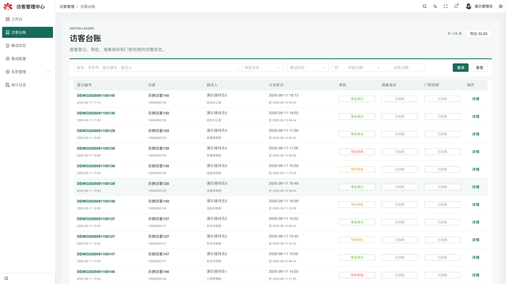

# 访客管理系统

[](LICENSE) [](https://vuejs.org/) [](https://www.oracle.com/java/technologies/javase/jdk17-archive-downloads.html)

面向园区和企业接待场景的访客管理系统。访客在 H5 页面提交申请，管理人员集中查看审批、来访记录与通行状态；可按目标环境接入消息通知、门禁和人脸服务。

[界面预览](#界面预览) · [在线体验](#在线体验) · [快速开始](#快速开始) · [文档](#文档) · [作者作品集](http://43.156.229.191:8080/portfolio/)

> 公开仓库提供通用业务代码和 Mock 适配器，不包含真实访客资料、证件或人脸文件。第三方 SDK 需自行取得授权，Mock 开关不会跳过编译期 SDK 依赖。

## 功能

- **访客登记**：H5 登记、申请查询、审批状态和结果展示。
- **管理台账**：访客记录、审批处理、用户与权限管理。
- **文件服务**：受控上传、对象存储抽象和短链访问。
- **集成适配**：消息通知、门禁/人脸服务接口和可替换的 Mock 适配器。
- **安全能力**：Token、敏感字段加密、权限校验和操作审计。

## 技术栈

| 层 | 技术 |
| --- | --- |
| 访客端 | Vue 3、Vite |
| 管理端 | Vue 3、TypeScript、Vite、Element Plus |
| 后端 | Java 17、Spring Boot、JPA、JWT |
| 基础设施 | MySQL、对象存储、Maven |

## 界面预览

### 访客台账与审批状态



图片来自已有演示环境，使用示例内容；当前部署版本的界面可能有所变化。

## 在线体验

- [访客管理端](http://43.156.229.191:9038/admin/)
- [访客登记 H5](http://43.156.229.191:9038/)

管理端需要登录。演示环境请使用虚构姓名、联系方式和测试图片，不接入真实访客证件或门禁设备。

## 快速开始

### 环境要求

Git、JDK 17、Maven、MySQL、npm、pnpm ≥9。管理端要求 Node `^20.19.0 || >=22.13.0`，可使用仓库 `.nvmrc` 指定的 Node 版本。

### 1. 获取代码

```bash
git clone https://github.com/WuZhaohui1993/visitor-public.git
cd visitor-public
```

### 2. 准备依赖与配置

后端 [pom.xml](visitor-server/pom.xml) 引用了 `com.hikvision.ga:artemis-http-client:1.1.15.RELEASE`。请通过获授权的依赖仓库或本地 Maven 仓库提供 SDK；本项目不分发该依赖。即使只运行 Mock，也需要先解决编译依赖。

以 [application.yml](visitor-server/src/main/resources/application.yml) 为准，通过启动进程注入配置：

| 配置 | 用途 |
| --- | --- |
| `DB_URL`、`DB_USERNAME`、`DB_PASSWORD` | 测试数据库连接 |
| `VISITOR_JWT_SECRET`、`VISITOR_AES_KEY` | 访客认证与敏感字段加密 |
| `VISITOR_ADMIN_ENABLED`、`VISITOR_ADMIN_JWT_SECRET` | 管理端开关与认证；管理端默认关闭 |
| `VISITOR_ADMIN_BOOTSTRAP_USERNAME`、`VISITOR_ADMIN_BOOTSTRAP_PASSWORD` | 初始管理账号 |
| `VISITOR_STORAGE_PROVIDER` 及 `VISITOR_STORAGE_*` / `MINIO_*` | 文件存储，按选用的 provider 配置 |
| `DINGTALK_ENABLED`、`DINGTALK_MOCK_MODE` | 消息平台接入与 Mock 行为 |

仓库未提供完整初始化 SQL；当前 JPA 配置默认 `update`，只在专用本地库验证，生产环境应自行管理迁移。数据库建表不等于角色、审批与集成配置已经就绪。

### 3. 启动三个模块

后端默认端口为 8080，而两个前端的默认 API 代理指向 9988。下面显式将本地后端设为 9988：

```bash
cd visitor-server
SERVER_PORT=9988 ./mvnw spring-boot:run
```

分别在另外两个终端中，从仓库根目录执行：

```bash
cd visitor-h5
npm install
npm run dev
```

```bash
cd visitor-admin
pnpm install
pnpm dev
```

访客端默认开发端口为 51766；管理端以启动日志为准。代理地址可通过 `VITE_PROXY_TARGET` 调整，跨域和 Cookie 来源需与实际访问地址一致。

## 测试

安装依赖并准备好上述配置后，在仓库根目录执行：

```bash
cd visitor-server
./mvnw test
./mvnw -DskipTests package
cd ..
npm --prefix visitor-h5 run build
pnpm --dir visitor-admin typecheck
pnpm --dir visitor-admin build
git diff --check
```

检查前需安装各模块依赖并准备专用测试配置。Mock 只能验证平台流程，不能证明真实门禁、人脸或钉钉接口已接通；还需验证审批权限、文件访问和到期回收。 `-DskipTests package` 仅表示跳过测试打包，不表示测试通过。

## 文档

- [后端配置](visitor-server/src/main/resources/application.yml)
- [SDK 与后端依赖](visitor-server/pom.xml)
- [访客端代理配置](visitor-h5/vite.config.js)
- [管理端代理配置](visitor-admin/vite.config.ts)
- [参与贡献](CONTRIBUTING.md)
- [安全说明](SECURITY.md)
- [第三方依赖与版权](THIRD_PARTY_NOTICES.md)

## 项目结构

```text
├── visitor-h5/             # 访客登记与结果查询
├── visitor-admin/          # 管理台账与审批界面
├── visitor-server/         # Spring Boot 服务与集成适配
└── docs/assets/            # README 演示截图
```

## 作者与作品集

- [GitHub · WuZhaohui1993](https://github.com/WuZhaohui1993)
- [个人作品集](http://43.156.229.191:8080/portfolio/)
- [问题反馈与功能建议](https://github.com/WuZhaohui1993/visitor-public/issues)

欢迎交流使用问题、反馈 Bug 或提出功能建议；项目合作可通过作品集中的联系方式沟通。

## 安全边界

证件、照片和联系方式应按最小权限访问；上传文件、访问令牌和对象存储分别隔离。第三方配置仅在部署环境中提供，启用真实设备前验证授权、有效期、撤销和审计行为。 更多说明见 [SECURITY.md](SECURITY.md)。

## 参与贡献

请先阅读 [贡献指南](CONTRIBUTING.md)，保持接口、权限、配置和文档同步。反馈问题时附上复现步骤、期望结果和必要截图；提交 PR 时说明实际执行的检查及未覆盖范围，不提交真实业务数据、私有凭据或构建产物。

## 许可证

本项目自有代码采用 [MIT License](LICENSE)。第三方组件、上游代码及厂商 SDK 遵循各自许可证；版权与再分发说明见 [THIRD_PARTY_NOTICES.md](THIRD_PARTY_NOTICES.md)。
